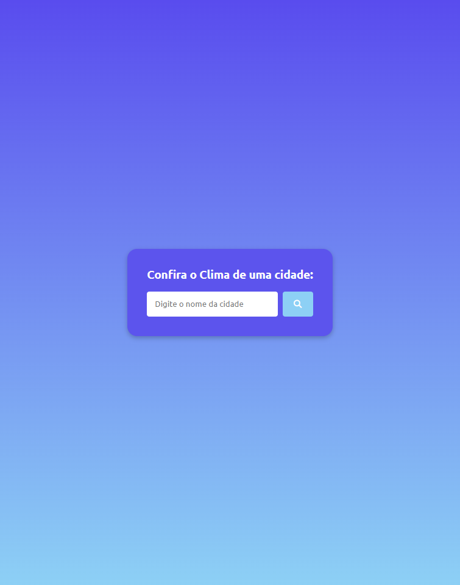
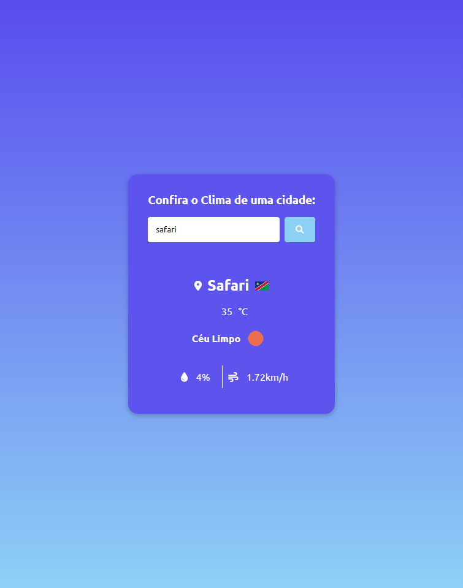

# Clima Agora

>Projeto 'Clima Agora'

Projeto <b><i><u>'Clima Agora'</b></i></u> descubra o Clima/Tempo de qualquer cidade do mundo com apenas um clique.  
Projeto construído seguindo as dicas do <b>Matheus Battisti - Hora de Codar</b> [YouTube](https://www.youtube.com/watch?v=VS8EBgPwsSU)

[🔗 Clique aqui para acessar](https://clima-tempo-agora.vercel.app/)

## 🌐 Tecnologias 

  
 
 
 

## 📱 Contato

